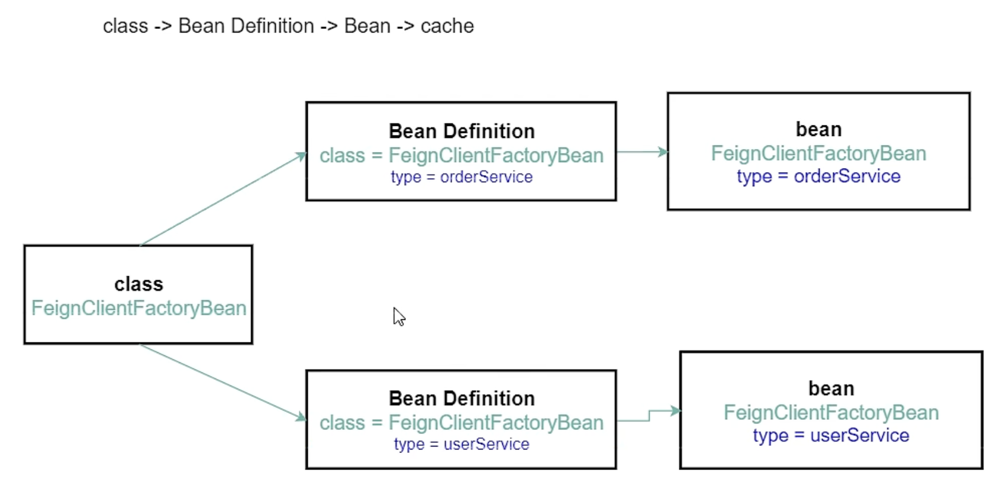

# First

## **什么是Open Feign?**

OpenFeign 是 Spring Cloud 全家桶的组件之一， 其核心的作用是为 Rest API 提供高效简洁的 RPC 调用方式

## **搭建测试项目**

### **服务接口和实体**

### **项目名称**

cloud-feign-api

### **实体类**

```java
public class Order implements Serializable {
    private Long id;
    private String name;

    public Order() {}

    public Order(Long id, String name) {
        this.id = id;
        this.name = name;
    }
}

public class User implements Serializable {

    private Long id;
    private String name;

    public User() {}

    public User(Long id, String name) {
        this.id = id;
        this.name = name;
    }
}

public class Result <T> implements Serializable
{
    private Integer code;
    private String message;
    private T data;

    public Result(Integer code, String message, T data) {
        this.code = code;
        this.message = message;
        this.data = data;
    }

    public Result(T data) {
        this(200, "操作成功", data);
    }
}
```

### **服务提供方**

### **项目名称**

cloud-feign-server

### **依赖 (pom.xml)**

```xml
<dependencies>
  <!--实体类-->
  <dependency>
    <groupId>org.example</groupId>
    <artifactId>cloud-feign-api</artifactId>
    <version>1.0-SNAPSHOT</version>
  </dependency>

  <!-- 注册中心 nacos -->
  <dependency>
    <groupId>com.alibaba.cloud</groupId>
    <artifactId>spring-cloud-starter-alibaba-nacos-discovery</artifactId>
  </dependency>

  <!-- web -->
  <dependency>
    <groupId>org.springframework.boot</groupId>
    <artifactId>spring-boot-starter-web</artifactId>
  </dependency>

  <!-- test -->
  <dependency>
    <groupId>org.springframework.boot</groupId>
    <artifactId>spring-boot-starter-test</artifactId>
    <scope>test</scope>
  </dependency>
</dependencies>
```

### **配置文件(application.yml)**

```
server:
  port: 9001

spring:
  application:
    name: cloud-feign-server
  cloud:
    nacos:
      discovery:
        server-addr: localhost:8848 #配置Nacos地址

```

### **配置类**

无

### **启动类**

```
@SpringBootApplication
@EnableDiscoveryClient
public class FeignServerMain {

    public static void main(String[] args)
    {
        SpringApplication.run(FeignServerMain.class,args);
    }
}
```

### **控制器**

```
@RestController
public class OrderServerController {

    @GetMapping(value = "/order/get/{id}")
    public Order getPaymentById(@PathVariable("id") Long id)
    {
        return new Order(id, "order");
    }
}

@RestController
public class UserServerController {

    @GetMapping(value = "/user/get/{id}")
    public User getUserById(@PathVariable("id") Long id)
    {
        return new User(id, "user");
    }
}
```

### **服务消费方**

### **项目名称**

cloud-feign-client

### **依赖 (pom.xml)**

```
<dependencies>
  <!--openfeign-->
  <dependency>
    <groupId>org.springframework.cloud</groupId>
    <artifactId>spring-cloud-starter-openfeign</artifactId>
  </dependency>

  <!--实体类-->
  <dependency>
    <groupId>org.example</groupId>
    <artifactId>cloud-feign-api</artifactId>
    <version>1.0-SNAPSHOT</version>
  </dependency>

  <!-- 注册中心 nacos -->
  <dependency>
    <groupId>com.alibaba.cloud</groupId>
    <artifactId>spring-cloud-starter-alibaba-nacos-discovery</artifactId>
  </dependency>

  <!--web-->
  <dependency>
    <groupId>org.springframework.boot</groupId>
    <artifactId>spring-boot-starter-web</artifactId>
  </dependency>

  <!--test-->
  <dependency>
    <groupId>org.springframework.boot</groupId>
    <artifactId>spring-boot-starter-test</artifactId>
    <scope>test</scope>
  </dependency>
</dependencies>
```

### **配置文件(application.yml)**

```
server:
  port: 9000

spring:
  application:
    name: feign-order-client
  cloud:
    nacos:
      discovery:
        server-addr: localhost:8848 #配置Nacos地址
```

### **配置类**

```
@Configuration
public class DefaultConfiguration {

}

@Configuration
public class OrderConfiguration {

}

@Configuration
public class UserConfiguration {

}
```

### **启动类**

```
@SpringBootApplication
@EnableFeignClients(defaultConfiguration = {DefaultConfiguration.class}) // 开启feign
@EnableDiscoveryClient
public class FeignClientMain {
    public static void main(String[] args)
    {
        SpringApplication.run(FeignClientMain.class,args);
    }
}
```

### **控制器**

```
@RestController
public class OrderClientController {

    @Resource
    private OrderService orderService;

    @GetMapping(value = "/consumer/feign/order/get/{id}")
    public Result<Order> getOrderById(@PathVariable("id") Long id)
    {
        Order order = orderService.getOrderById(id);
        return new Result<>(order);
    }
}

@RestController
public class UserClientController {

    @Resource
    private UserService userService;

    @GetMapping(value = "/consumer/feign/user/get/{id}")
    public Result<User> getUserById(@PathVariable("id") Long id)
    {
        User user = userService.getUserById(id);
        return new Result<>(user);
    }
}
```

### **服务接口**

```
// http://localhost:9000/consumer/feign/order/get/1
@FeignClient(value = "cloud-feign-server", contextId = "order", configuration = OrderConfiguration.class)
public interface OrderService {

    @GetMapping(value = "/order/get/{id}")
    Order getOrderById(@PathVariable("id") Long id);
}

// http://localhost:9000/consumer/feign/user/get/1
@FeignClient(value = "cloud-feign-server", contextId = "user", configuration = UserConfiguration.class)
public interface UserService {

    @GetMapping(value = "/user/get/{id}")
    User getUserById(@PathVariable("id") Long id);
}
```

## **问题：为何只定义接口而没有实现类？**

### **思路分析**

### **问题一：如何动态生成实现类做到？**

动态代理 （cglib, jdk)

### **问题二：代理对象如何交给spring容器？**

把Bean交给spring容器的方法：

1.xml 声明bean  <bean id="", class="">

2.@ConponentScan + @Sevice/@Controller/@Repository/@Componet

3.@Import(XXX.class)

4.ImportSelector 接口 -> 返回类名数组

5.ImportBeanDefinitionRegistrar 接口 -> registerBeanDefinitions

6.@Bean 注解

7.FactoryBean 接口 -> getObject()

8.SingletonBeanRegistry.registerSingleton(); API

前五种方法bean的创建过程是交给spring负责的，流程如下

class -> bean definition -> bean -> put in cache

如何把一个第三方的对象（完全由程序员控制对象创建过程）交给Spring管理？

1.factoryBean

2.SingletonBeanRegistry.registerSingleton();

3.@Bean

openFeign源码采用的是factoryBean

### **问题三：多个接口需要写多个对应的factoryBean类吗？**

不需要

1）只要定义一个factoryBean类，把接口的Class作为变量传给factoryBean

2）针对不同的接口需要创建不同的factoryBean对象，每个factoryBean对象所持有的接口类型是不同的。

```java
class FeignClientFactoryBean implements FactoryBean<Object> {
  private Class<?> type; // 接口类型

    @Override
  public Object getObject() throws Exception {
        // 返回代理对象
    return Proxy.newProxyInstance(this.getClassLoader(),new Class<?>[] {type}, new InvocationHandler());
  }
}
```

关于FactoryBean：

[Spring中的BeanFactory与FactoryBean看这一篇就够了 - 宜春 - 博客园](https://www.cnblogs.com/yichunguo/p/13922189.html)

### **问题四：一个factoryBean类如何创建多个持有不同的接口类型的对象?**

不可以用原型模式。

关于原型模式：

[Java设计模式：Prototype(原型)模式 - clover_toeic - 博客园](https://www.cnblogs.com/clover-toeic/p/11600486.html)



1）创建多个Bean Definition

BeanDefinitionBuilder.build()

2）每个Bean Definition 指定不同的接口类型

BeanDefinitionBuilder.addPropertyValue(String name, @Nullable Object value)

BeanDefinitionBuilder.addConstructorArgValue(@Nullable Object value)

### **问题五：如何优雅地把自定义的Bean Definition交给Spring?**

**注意和问题二的区别：一个是代理对象，一个是bean定义**

ImportBeanDefinitionRegistrar 接口

-> registerBeanDefinitions(AnnotationMetadata importingClassMetadata, BeanDefinitionRegistry registry)

@Import、ImportSelector、ImportBeanDefinitionRegistrar的使用和区别

1）@Import(XXX.class)一般配合ImportSelector或者ImportBeanDefinitionRegistrar使用

2）ImportSelector返回的是全类名数组，用于选择需要的配置类

3）ImportBeanDefinitionRegistrar提供BeanDefinitionRegistry，用于注册自定义的Bean Definition

关于@Import、ImportSelector：

[谈谈Spring的ImportSelector和ImportBeanDefinitionRegistrar - 苦行僧DH - 博客园](https://www.cnblogs.com/daihang2366/p/15080679.html)

[SpringBoot教程(2) @Import和ImportSelector的使用-CSDN博客](https://blog.csdn.net/winterking3/article/details/114537557)

### **问题六：如何获取带有@FeignClient注解的接口以及注解信息？**

包扫描

Spring 提供ClassPathScanningCandidateComponentProvider类做包扫描功能

```java
public class ClassPathScanningCandidateComponentProvider implements EnvironmentCapable, ResourceLoaderAware {
    private final List<TypeFilter> includeFilters = new LinkedList<>();

  private final List<TypeFilter> excludeFilters = new LinkedList<>();

    public Set<BeanDefinition> findCandidateComponents(String basePackage) {
    if (this.componentsIndex != null && indexSupportsIncludeFilters()) {
      return addCandidateComponentsFromIndex(this.componentsIndex, basePackage);
    }
    else {
      return scanCandidateComponents(basePackage);
    }
  }

    private Set<BeanDefinition> scanCandidateComponents(String basePackage) {
    Set<BeanDefinition> candidates = new LinkedHashSet<>();
    try {
      String packageSearchPath = ResourcePatternResolver.CLASSPATH_ALL_URL_PREFIX +
          resolveBasePackage(basePackage) + '/' + this.resourcePattern;
      Resource[] resources = getResourcePatternResolver().getResources(packageSearchPath);

      for (Resource resource : resources) {
        if (resource.isReadable()) {
          try {
            MetadataReader metadataReader = getMetadataReaderFactory().
                            getMetadataReader(resource);
                        // 第一次判断是否是候选组件
            if (isCandidateComponent(metadataReader)) {
              ScannedGenericBeanDefinition sbd = new ScannedGenericBeanDefinition
                                (metadataReader);
              sbd.setResource(resource);
              sbd.setSource(resource);
                            // 第二次判断是否是候选组件
              if (isCandidateComponent(sbd)) {
                candidates.add(sbd);
              }
            }
          }
          catch (Throwable ex) {
            throw new BeanDefinitionStoreException(
                "Failed to read candidate component class: " + resource, ex);
          }
        }
      }
    }
    catch (IOException ex) {
      throw new BeanDefinitionStoreException("I/O failure during classpath scanning", ex);
    }
    return candidates;
  }

    /** 用类型过滤器来判断是否是候选的组件 */
		//类型过滤器中有一个为AnnotationTypeFilter，可以通过注解过滤
    protected boolean isCandidateComponent(MetadataReader metadataReader) throws IOException {
    for (TypeFilter tf : this.excludeFilters) {
      if (tf.match(metadataReader, getMetadataReaderFactory())) {
        return false;
      }
    }
    for (TypeFilter tf : this.includeFilters) {
      if (tf.match(metadataReader, getMetadataReaderFactory())) {
        return isConditionMatch(metadataReader);
      }
    }
    return false;
  }

    /** 判断bean定义是否符合候选的组件:独立的并且是具体的(不是接口或抽象类)  可以重写 */
    protected boolean isCandidateComponent(AnnotatedBeanDefinition beanDefinition) {
    AnnotationMetadata metadata = beanDefinition.getMetadata();
    return (metadata.isIndependent() && (metadata.isConcrete() ||
        (metadata.isAbstract() && metadata.hasAnnotatedMethods(Lookup.class.getName()))));
  }
}
```

### **源码解读**

### **EnableFeignClients**

```java
@Import(FeignClientsRegistrar.class)
public @interface EnableFeignClients {

  // basePackages的别名
  String[] value() default {};

  // 扫描的包
  String[] basePackages() default {};

  // 扫描的包的class
  Class<?>[] basePackageClasses() default {};

    // 默认的配置类
  Class<?>[] defaultConfiguration() default {};

  // 手动传入的feign client对应的Class
  Class<?>[] clients() default {};

}
```

### **FeignClientsRegistrar**

```java
class FeignClientsRegistrar
    implements **ImportBeanDefinitionRegistrar**, ResourceLoaderAware, EnvironmentAware {//继承了**ImportBeanDefinitionRegistrar接口**
    @Override
  public void registerBeanDefinitions(AnnotationMetadata metadata,
      BeanDefinitionRegistry registry) {
        // 注册默认配置
    registerDefaultConfiguration(metadata, registry);
        // 注册feign clients
    **registerFeignClients**(metadata, registry);
  }

    /** 注册默认配置的bean定义(FeignClientSpecification) */
    private void registerDefaultConfiguration(AnnotationMetadata metadata,
      BeanDefinitionRegistry registry) {
        // 从EnableFeignClients注解取出所有的属性 值
	    Map<String, Object> defaultAttrs = metadata
	        .getAnnotationAttributes(EnableFeignClients.class.getName(), true);
	
	        // 如果有配置defaultConfiguration
	    if (defaultAttrs != null && defaultAttrs.containsKey("defaultConfiguration")) {
	      String name;
	      if (metadata.hasEnclosingClass()) {
	        name = "default." + metadata.getEnclosingClassName();
	      }
	      else {
	        name = "default." + metadata.getClassName();
	      }
	      registerClientConfiguration(registry, name,
	          defaultAttrs.get("defaultConfiguration"));
	    }
  }

    /** 注册所有的feign client的bean定义(FeignClientFactoryBean) */
    public void **registerFeignClients**(AnnotationMetadata metadata,
      BeanDefinitionRegistry registry) {
        // 获取扫描器
	    ClassPathScanningCandidateComponentProvider scanner = **getScanner**();
	    scanner.setResourceLoader(this.resourceLoader);
	
	    Set<String> basePackages;
	
			//获取注解里的属性值
	    Map<String, Object> attrs = metadata.getAnnotationAttributes(EnableFeignClients.class.getName());
	        // 创建注解类型的过滤器用于过滤出带有FeignClient注解的类或接口
	    AnnotationTypeFilter annotationTypeFilter = new AnnotationTypeFilter(FeignClient.class);
			//扫描是否有client属性值：FeignClient注解的client属性可以直接列举出feign接口的数组
	    final Class<?>[] clients = attrs == null ? null: (Class<?>[]) attrs.get("clients");
	    if (clients == null || clients.length == 0) {
	      scanner.addIncludeFilter(annotationTypeFilter);
				//如果指定了basepackage或者value，则直接得到；如果没指定，默认扫描添加FeignClient注解的类所在的包
	      basePackages = **getBasePackages**(metadata);
	    }
	    else {
	      final Set<String> clientClasses = new HashSet<>();
	      basePackages = new HashSet<>();
	      for (Class<?> clazz : clients) {
	        basePackages.add(ClassUtils.getPackageName(clazz));
	        clientClasses.add(clazz.getCanonicalName());
	      }
	      AbstractClassTestingTypeFilter filter = new AbstractClassTestingTypeFilter() {
	        @Override
	        protected boolean match(ClassMetadata metadata) {
	          String cleaned = metadata.getClassName().replaceAll("\\$", ".");
	          return clientClasses.contains(cleaned);
	        }
	      };
	      scanner.addIncludeFilter(
	          new AllTypeFilter(Arrays.asList(filter, annotationTypeFilter)));
	    }
	
	        /** 进行包扫描 */
	    for (String basePackage : basePackages) {
	            // 根据每一个包找出候选的bean定义
	      Set<BeanDefinition> candidateComponents = scanner
	          .findCandidateComponents(basePackage);
	      for (BeanDefinition candidateComponent : candidateComponents) {
	        if (candidateComponent instanceof AnnotatedBeanDefinition) {
	          AnnotatedBeanDefinition beanDefinition = (AnnotatedBeanDefinition) candidateComponent;
	                    // 获取注解的数据
	          AnnotationMetadata annotationMetadata = beanDefinition.getMetadata();
	          // 获取FeignClient注解的属性值
	          Map<String, Object> attributes = annotationMetadata
	              .getAnnotationAttributes(
	                  FeignClient.class.getCanonicalName());
	          // 获取FeignClient的名字
	          String name = **getClientName**(attributes);
	                    // 注册每个feign client注册对应的配置(FeignClientSpecification)
	          registerClientConfiguration(registry, name,
	              attributes.get("configuration"));
	          // 注册feign client的bean定义(FeignClientFactoryBean)
	          registerFeignClient(registry, annotationMetadata, attributes);
	        }
	      }
	    }
	  }

    /** 获取扫描器 重写第二个isCandidateComponent */
    protected ClassPathScanningCandidateComponentProvider **getScanner**() {
	    return new ClassPathScanningCandidateComponentProvider(false, this.environment) {
	      @Override
	      protected boolean isCandidateComponent(
	          AnnotatedBeanDefinition beanDefinition) {
	        boolean isCandidate = false;
	                // bean定义对应的class不能是注解
	        if (beanDefinition.getMetadata().isIndependent()) {
	          if (!beanDefinition.getMetadata().isAnnotation()) {
	            isCandidate = true;
	          }
	        }
	        return isCandidate;
	      }
	    };
	  }

    /** 根据配置类生成并注册FeignClientSpecification的bean定义*/
    private void registerClientConfiguration(BeanDefinitionRegistry registry, Object name,
      Object configuration) {

	    BeanDefinitionBuilder builder = BeanDefinitionBuilder
	        .genericBeanDefinition(FeignClientSpecification.class);
	    builder.addConstructorArgValue(name);
	    builder.addConstructorArgValue(configuration);
	    registry.registerBeanDefinition(
	        name + "." + FeignClientSpecification.class.getSimpleName(),
	        builder.getBeanDefinition());
	  }

    /** 生成并注册FeignClientFactoryBean的bean定义 */
    private void registerFeignClient(BeanDefinitionRegistry registry,
      AnnotationMetadata annotationMetadata, Map<String, Object> attributes) {
	    String className = annotationMetadata.getClassName();
	    **BeanDefinitionBuilder definition = BeanDefinitionBuilder
	        .genericBeanDefinition(FeignClientFactoryBean.class);**
	    validate(attributes);
	    definition.addPropertyValue("url", getUrl(attributes));
	    definition.addPropertyValue("path", getPath(attributes));
	    String name = getName(attributes);
	    definition.addPropertyValue("name", name);
	    String contextId = getContextId(attributes);
	    definition.addPropertyValue("contextId", contextId);
	    definition.addPropertyValue("type", className);
	    definition.addPropertyValue("decode404", attributes.get("decode404"));
	    definition.addPropertyValue("fallback", attributes.get("fallback"));
	    definition.addPropertyValue("fallbackFactory", attributes.get("fallbackFactory"));
	    definition.setAutowireMode(AbstractBeanDefinition.AUTOWIRE_BY_TYPE);
	
	    String alias = contextId + "FeignClient";
	    **AbstractBeanDefinition beanDefinition = definition.getBeanDefinition();**
	
	    boolean primary = (Boolean) attributes.get("primary"); // has a default, won't be
	                                // null
	
	    beanDefinition.setPrimary(primary);
	
	    String qualifier = getQualifier(attributes);
	    if (StringUtils.hasText(qualifier)) {
	      alias = qualifier;
	    }
		
	    BeanDefinitionHolder holder = new BeanDefinitionHolder(beanDefinition, className,
	        new String[] { alias });
	    **BeanDefinitionReaderUtils.registerBeanDefinition(holder, registry);**
	  }
}
```

### **FeignClientFactoryBean**

```
class FeignClientFactoryBean
		implements FactoryBean<Object>, InitializingBean, ApplicationContextAware {

    private Class<?> type;

    @Override
	public Object getObject() throws Exception {
		return getTarget();
	}

	/**
	 * @param <T> the target type of the Feign client
	 * @return a {@link Feign} client created with the specified data and the context
	 * information
	 */
	<T> T getTarget() {
		FeignContext context = this.applicationContext.getBean(FeignContext.class);
		Feign.Builder builder = feign(context);

		if (!StringUtils.hasText(this.url)) {
			if (!this.name.startsWith("http")) {
				this.url = "http://" + this.name;
			}
			else {
				this.url = this.name;
			}
			this.url += cleanPath();
			return (T) loadBalance(builder, context,
					new HardCodedTarget<>(this.type, this.name, this.url));
		}
		if (StringUtils.hasText(this.url) && !this.url.startsWith("http")) {
			this.url = "http://" + this.url;
		}
		String url = this.url + cleanPath();
		Client client = getOptional(context, Client.class);
		if (client != null) {
			if (client instanceof LoadBalancerFeignClient) {
				// not load balancing because we have a url,
				// but ribbon is on the classpath, so unwrap
				client = ((LoadBalancerFeignClient) client).getDelegate();
			}
			if (client instanceof FeignBlockingLoadBalancerClient) {
				// not load balancing because we have a url,
				// but Spring Cloud LoadBalancer is on the classpath, so unwrap
				client = ((FeignBlockingLoadBalancerClient) client).getDelegate();
			}
			builder.client(client);
		}
		Targeter targeter = get(context, Targeter.class);
		return (T) targeter.target(this, builder, context,
				new HardCodedTarget<>(this.type, this.name, url));
	}
}
```

### **DefaultTargeter**

```
class DefaultTargeter implements Targeter {

	@Override
	public <T> T target(FeignClientFactoryBean factory, Feign.Builder feign,
			FeignContext context, Target.HardCodedTarget<T> target) {
		return feign.target(target);
	}

}
```

### **Feign**

```
public abstract class Feign {

  public static Builder builder() {
    return new Builder();
  }

  public <T> T target(Target<T> target) {
    return build().newInstance(target);
  }

  public Feign build() {
      SynchronousMethodHandler.Factory synchronousMethodHandlerFactory =
          new SynchronousMethodHandler.Factory(client, retryer, requestInterceptors, logger,
                                               logLevel, decode404, closeAfterDecode, propagationPolicy);
      ParseHandlersByName handlersByName =
          new ParseHandlersByName(contract, options, encoder, decoder, queryMapEncoder,
                                  errorDecoder, synchronousMethodHandlerFactory);
      return new ReflectiveFeign(handlersByName, invocationHandlerFactory, queryMapEncoder);
  }
}
```

### **ReflectiveFeign**

```
public class ReflectiveFeign extends Feign {

  private final InvocationHandlerFactory factory;
  @Override
  public <T> T newInstance(Target<T> target) {
    Map<String, MethodHandler> nameToHandler = targetToHandlersByName.apply(target);
    Map<Method, MethodHandler> methodToHandler = new LinkedHashMap<Method, MethodHandler>();
    List<DefaultMethodHandler> defaultMethodHandlers = new LinkedList<DefaultMethodHandler>();

    for (Method method : target.type().getMethods()) {
      if (method.getDeclaringClass() == Object.class) {
        continue;
      } else if (Util.isDefault(method)) {
        DefaultMethodHandler handler = new DefaultMethodHandler(method);
        defaultMethodHandlers.add(handler);
        methodToHandler.put(method, handler);
      } else {
        methodToHandler.put(method, nameToHandler.get(Feign.configKey(target.type(), method)));
      }
    }
    InvocationHandler handler = factory.create(target, methodToHandler);
    T proxy = (T) Proxy.newProxyInstance(target.type().getClassLoader(),
        new Class<?>[] {target.type()}, handler);

    for (DefaultMethodHandler defaultMethodHandler : defaultMethodHandlers) {
      defaultMethodHandler.bindTo(proxy);
    }
    return proxy;
  }
}
```

### **总结**

设计：只需要定义接口 + 注解， 没有具体的实现类

解决方案：根据接口动态生成代理对象，把增强功能封装在里面，并把此对象交给spring管理

技术点：动态代理，factoryBean接口，包扫描，如何把自定义的Bean 定义交给spring（ImportBeanDefinitionRegistrar）, 如何把自定义的对象交给spring备份

本节OpenFeign的原理和mybatis原理几乎相同