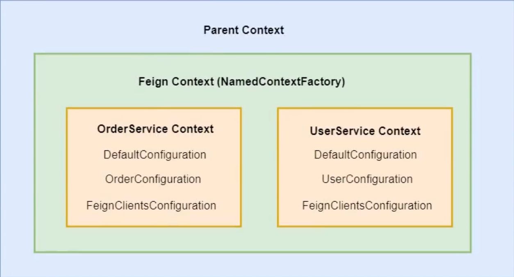

# Third

# **配置体系**

## **配置类**

### **应用级别配置（全局）**

```java
@Retention(RetentionPolicy.RUNTIME)
@Target(ElementType.TYPE)
@Documented
@Import(FeignClientsRegistrar.class) // 注册feign client的bean定义
public @interface EnableFeignClients {

  String[] value() default {};
  String[] basePackages() default {};
  Class<?>[] basePackageClasses() default {};
  Class<?>[] defaultConfiguration() default {}; // 默认配置全局有效
  Class<?>[] clients() default {};
}
```

```java
@SpringBootApplication
@EnableFeignClients(defaultConfiguration = {DefaultConfiguration.class}) // 配置在启动类上
@EnableDiscoveryClient
public class FeignClientMain {
  // ...
}
```

### **服务级别配置**

```
@Target(ElementType.TYPE)
@Retention(RetentionPolicy.RUNTIME)
@Documented
public @interface FeignClient {
    // ...
    Class<?>[] configuration() default {}; // 只对服务接口有效
    // ...
}
```

```
// 配置在服务接口
@FeignClient(value = "cloud-feign-server", contextId = "order", configuration = OrderConfiguration.class)
public interface OrderService {
  // ...
}

@FeignClient(value = "cloud-feign-server", contextId = "user", configuration = UserConfiguration.class)
public interface UserService {
    // ...
}
```

### **配置隔离原理**

一句话：通过spring子容器进行隔离，不同的feign client接口对应不同的子容器，里面有自己独立的配置

### **1) 注册配置类到spring父容器**

```java
class **FeignClientsRegistrar //这个类通过@FeignCLients -> @Import注入**
    implements ImportBeanDefinitionRegistrar, ResourceLoaderAware, EnvironmentAware {

    /** ImportBeanDefinitionRegistrar的方法 */
  @Override
  public void registerBeanDefinitions(AnnotationMetadata metadata,
      BeanDefinitionRegistry registry) {
    registerDefaultConfiguration(metadata, registry);
    registerFeignClients(metadata, registry);
  }

    /** 注册默认的配置类 */
    private void registerDefaultConfiguration(AnnotationMetadata metadata,
      BeanDefinitionRegistry registry) {
        // 获取ableFeignClients注解的信息
    Map<String, Object> defaultAttrs = metadata
        .getAnnotationAttributes(EnableFeignClients.class.getName(), true);

        // 获取defaultConfiguration的值
    if (defaultAttrs != null && defaultAttrs.containsKey("defaultConfiguration")) {
      String name;
      if (metadata.hasEnclosingClass()) {
        name = "default." + metadata.getEnclosingClassName();
      }
      else {
        name = "default." + metadata.getClassName();
      }
      registerClientConfiguration(registry, name,
          defaultAttrs.get("defaultConfiguration"));
    }
  }

    public void registerFeignClients(AnnotationMetadata metadata,
      BeanDefinitionRegistry registry) {
        // ...

    for (String basePackage : basePackages) {
      Set<BeanDefinition> candidateComponents = scanner
          .findCandidateComponents(basePackage);
      for (BeanDefinition candidateComponent : candidateComponents) {
        if (candidateComponent instanceof AnnotatedBeanDefinition) {
          // verify annotated class is an interface
          AnnotatedBeanDefinition beanDefinition = (AnnotatedBeanDefinition) candidateComponent;
          AnnotationMetadata annotationMetadata = beanDefinition.getMetadata();
          Assert.isTrue(annotationMetadata.isInterface(),
              "@FeignClient can only be specified on an interface");

          Map<String, Object> attributes = annotationMetadata
              .getAnnotationAttributes(
                  FeignClient.class.getCanonicalName());

          String name = getClientName(attributes);
                    // 注册服务接口的配置类
          registerClientConfiguration(registry, name, attributes.get("configuration"));

          registerFeignClient(registry, annotationMetadata, attributes);
        }
      }
    }
    }

    // 注意这里不是注册配置类本身 注册的是FeignClientSpecification 但里面封装了配置类
    private void registerClientConfiguration(BeanDefinitionRegistry registry, Object name,
      Object configuration) {
        // 注册FeignClientSpecification的bean定义
    BeanDefinitionBuilder builder = BeanDefinitionBuilder
        .genericBeanDefinition(**FeignClientSpecification**.class);
    builder.addConstructorArgValue(name);
        // 把配置类通过构造方法传入
    builder.addConstructorArgValue(configuration);
    registry.registerBeanDefinition(
        name + "." + FeignClientSpecification.class.getSimpleName(),
        builder.getBeanDefinition());
  }
}
```

注意不是直接注册配置类本身，而是 FeignClientSpecification 类

```java
public class FeignClientSpecification implements NamedContextFactory.Specification {

	private String name;

	private String className;
	//配置类
	private Class<?>[] configuration;

	......
```

- 注册配置类本身和注册规格（FeignClientSpecification）类的区别：
    
    如果直接注册配置类本身，就会走spring中refresh的流程，会把配置类中的bean都创建出来并放入父容器中
    
    而注册规格类，在整个ioc期间就不会去解析配置类
    

### **2) 注入配置类到FeignContext**

```java
@Configuration(proxyBeanMethods = false)
@ConditionalOnClass(Feign.class)
@EnableConfigurationProperties({ FeignClientProperties.class,
    FeignHttpClientProperties.class })
@Import(DefaultGzipDecoderConfiguration.class)
public class FeignAutoConfiguration {

    // 把所有FeignClientSpecification对象注入到集合里面
  @Autowired(required = false)
  **private List<FeignClientSpecification> configurations = new ArrayList<>();**

  @Bean
  public FeignContext feignContext() {
    FeignContext context = new FeignContext();
    context.setConfigurations(this.configurations);
    return context;
  }
}
```

### **3) 从FeignContext中获取组件**

```java
class FeignClientFactoryBean
    implements FactoryBean<Object>, InitializingBean, ApplicationContextAware {
  // ...

    // 使用配置类进行配置
  protected void configureUsingConfiguration(FeignContext context,
      Feign.Builder builder) {
        // 从spring容器获取组件
        Logger.Level level = getOptional(context, Logger.Level.class);

        // ...

        // 从spring容器获取组件
        Map<String, RequestInterceptor> requestInterceptors = context
        .**getInstances**(this.contextId, RequestInterceptor.class);

        // ...
  }

    protected <T> T getOptional(FeignContext context, Class<T> type) {
    return context.getInstance(this.contextId, type);
  }
}
```

### **4) 创建子容器加载配置**

```java
// FeignContext
public class FeignContext extends NamedContextFactory<FeignClientSpecification> {

  public FeignContext() {
        // 传入FeignClients的官方默认配置类
    super(FeignClient**s**Configuration.class, "feign", "feign.client.name");
  }
}

// 带名字的上下文工厂
public abstract class NamedContextFactory<C extends NamedContextFactory.Specification>
    implements DisposableBean, ApplicationContextAware {

    public NamedContextFactory(Class<?> defaultConfigType, String propertySourceName,
      String propertyName) {
    this.defaultConfigType = defaultConfigType; // 传入官方默认配置类
    this.propertySourceName = propertySourceName;
    this.propertyName = propertyName;
  }

    // 存储子容器的Map
    private Map<String, AnnotationConfigApplicationContext> contexts = new ConcurrentHashMap<>();

    // value是FeignClientSpecification对象
  private Map<String, C> configurations = new ConcurrentHashMap<>();

    // 父容器 通过ApplicationContextAware注入
  private ApplicationContext parent;

    // 默认配置类是FeignClientsConfiguration
    private Class<?> defaultConfigType;

    /** 把配置的List转为Map */
    public void setConfigurations(List<C> configurations) {
    for (C client : configurations) {
      this.configurations.put(client.getName(), client);
    }
  }

    // 从spring父子容器中获取单个对象
    public <T> T getInstance(String name, Class<T> type) {
    AnnotationConfigApplicationContext context = getContext(name);
    if (BeanFactoryUtils.beanNamesForTypeIncludingAncestors(context,
        type).length > 0) {
      return context.getBean(type);
    }
    return null;
  }

    // 从spring父子容器中获取多个对象
    public <T> Map<String, T> getInstances(String name, Class<T> type) {
    AnnotationConfigApplicationContext context = getContext(name);
    if (BeanFactoryUtils.beanNamesForTypeIncludingAncestors(context,
        type).length > 0) {
      return BeanFactoryUtils.beansOfTypeIncludingAncestors(context, type);
    }
    return null;
  }

    /** 获取context */
    protected AnnotationConfigApplicationContext getContext(String name) {
    if (!this.contexts.containsKey(name)) {
      synchronized (this.contexts) {
        if (!this.contexts.containsKey(name)) {
          this.contexts.put(name, createContext(name));
        }
      }
    }
    return this.contexts.get(name);
  }

    /** 创建context */
    protected AnnotationConfigApplicationContext createContext(String name) {
       // 每个接口创建自己的子容器
       AnnotationConfigApplicationContext context = new AnnotationConfigApplicationContext();
       // 注册属于服务接口的配置类
        if (this.configurations.containsKey(name)) {
          for (Class<?> configuration : this.configurations.get(name)
                .getConfiguration()) {
             context.register(configuration);
          }
       }
        // 注册应用全局的配置类
       for (Map.Entry<String, C> entry : this.configurations.entrySet()) {
          if (entry.getKey().startsWith("default.")) {
             for (Class<?> configuration : entry.getValue().getConfiguration()) {
                context.register(configuration);
             }
          }
       }
       // 注册默认的配置类
       context.register(PropertyPlaceholderAutoConfiguration.class,
             this.defaultConfigType);

       context.getEnvironment().getPropertySources().addFirst(new MapPropertySource(
             this.propertySourceName,
             Collections.<String, Object>singletonMap(this.propertyName, name)));

       // 父容器就是当前应用的spring容器
       if (this.parent != null) {
          context.setParent(this.parent);
          context.setClassLoader(this.parent.getClassLoader());
       }
       context.setDisplayName(generateDisplayName(name));
       context.**refresh**();
       return context;
    }
}
```

### **配置类示意图**

parent context type : AnnotationConfigServletWebApplicationContext ：不允许bean 定义覆盖

child context type:  AnnotationConfigApplicationContext ：允许bean 定义覆盖



子容器中有三种配置：全局默认配置，接口个性化配置，feignclient默认配置

### **问题：**

如果同时添加了全局和服务级别的配置，那会发生什么？

1）启动报错 2）全局配置生效 3）服务级别的配置生效

答案: 2）全局配置生效

两个bean的类型和名字都是一样的，会不会报错取决于一个属性allowBeanDefinitionOverriding：是否允许bean定义进行覆盖

父容器的allowBeanDefinitionOverriding是false，而子容器的allowBeanDefinitionOverriding是true

所以在子容器中允许bean定义的覆盖

在**[创建子容器加载配置](Third.md)**中，先加载的是接口个性化配置，后加载的是默认全局配置，所以全局配置会覆盖服务级别的配置

## **配置文件**

application.properties 或 application.yml

```yaml
feign:
  client:
    defaultToProperties: false
    config: # 对应FeignClientProperties类的config成员变量
      default: # 全局配置
        # 日志级别
        logger-level: BASIC
        # 超时时间
        connect-timeout: 10000

			# 接口配置
      order:
        # 日志级别
        logger-level: HEADERS
        # 超时时间
        connect-timeout: 8000
      user:
        # 日志级别
        logger-level: FULL
        # 超时时间
        connect-timeout: 6000
```

属性绑定Properties类

```java
@ConfigurationProperties("feign.client") // 配置的前缀 feign.client
public class FeignClientProperties {

    // 以配置文件的为准
	private boolean defaultToProperties = true;

    // 默认配置的名称 default
	private String defaultConfig = "default";

    // 可以自定义多个配置 key为配置名称
	private Map<String, FeignClientConfiguration> config = new HashMap<>();

	/**
	 * Feign client configuration.
	 */
	//注意不要和官方配置类（FeignClient**s**Configuration）混淆 这只是一个用来封装的普通类
	public static class FeignClientConfiguration {

		private Logger.Level loggerLevel;  // 日志级别

		private Integer connectTimeout;  // 连接超时

		private Integer readTimeout;  // 读取超时

		private Class<Retryer> retryer;  // 重试

		private Class<ErrorDecoder> errorDecoder; // 错误解码器

		private List<Class<RequestInterceptor>> requestInterceptors;  // 拦截器

		private Boolean decode404;

		private Class<Decoder> decoder; // 解码器

		private Class<Encoder> encoder; // 编码器

		private Class<Contract> contract; // 契约
    }
}
```

### **配置类和配置文件的优先级**

由于`private String defaultConfig = "default";`，所以默认以配置文件为准

<aside>
⚠️ 在使用配置文件配置的时候，先加载的是全局配置，后加载的是接口配置，所以服务级别的配置可以覆盖默认配置，与**[创建子容器加载配置](Third.md)**中相反

</aside>

```java
class FeignClientFactoryBean
implements FactoryBean < Object > , InitializingBean, ApplicationContextAware {
    // ...

    // 配置 feign
    protected void configureFeign(FeignContext context, Feign.Builder builder) {
        // 从配置文件获取（属性绑定）
        FeignClientProperties properties = this.applicationContext
            .getBean(FeignClientProperties.class);

        if (properties != null) {
            // 如果有配置文件有配置
            if (properties.isDefaultToProperties()) {
                // isDefaultToProperties默认为true 即默认以配置文件的配置为准
                // 因此先通过配置类进行配置 然后通过配置文件进行配置
                configureUsingConfiguration(context, builder);
                // 对于配置文件而言 服务级别的配置可以覆盖默认配置
									//加载全局配置
                configureUsingProperties(
                    properties.getConfig().get(properties.getDefaultConfig()),
                    builder);
									// 此contextId可以在@FeignClient注解属性中配置，也可以配置文件直接指定
									//加载接口配置
                configureUsingProperties(properties.getConfig().get(this.contextId),
                    builder);
            } else {
                // isDefaultToProperties如果设置为false 即默认以配置类的配置为准
                // 因此先通过配置文件进行配置 然后通过配置类进行配置
                configureUsingProperties(
                    properties.getConfig().get(properties.getDefaultConfig()),
                    builder);
									// 此contextId可以在@FeignClient注解属性中配置，也可以配置文件直接指定
                configureUsingProperties(properties.getConfig().get(this.contextId),
                    builder);
                configureUsingConfiguration(context, builder);
            }
        } else {
            // 如果配置文件没有配置则直接从配置类进行配置
            configureUsingConfiguration(context, builder);
        }
    }

    // 使用配置类进行配置
    protected void configureUsingConfiguration(FeignContext context,
        Feign.Builder builder) {
        // 日志级别
        Logger.Level level = getOptional(context, Logger.Level.class);
        if (level != null) {
            builder.logLevel(level);
        }

        // 重试器
        Retryer retryer = getOptional(context, Retryer.class);
        if (retryer != null) {
            builder.retryer(retryer);
        }

        // 错误编码
        ErrorDecoder errorDecoder = getOptional(context, ErrorDecoder.class);
        if (errorDecoder != null) {
            builder.errorDecoder(errorDecoder);
        }

        // 请求参数(连接超时 读取超时等)
        Request.Options options = getOptional(context, Request.Options.class);
        if (options != null) {
            builder.options(options);
        }

        // 拦截器
        Map < String, RequestInterceptor > requestInterceptors = context
            .getInstances(this.contextId, RequestInterceptor.class);
        if (requestInterceptors != null) {
            builder.requestInterceptors(requestInterceptors.values());
        }

        QueryMapEncoder queryMapEncoder = getOptional(context, QueryMapEncoder.class);
        if (queryMapEncoder != null) {
            builder.queryMapEncoder(queryMapEncoder);
        }

        if (this.decode404) {
            builder.decode404();
        }
    }

    // 使用配置文件进行配置
    protected void configureUsingProperties(
        FeignClientProperties.FeignClientConfiguration config,
        Feign.Builder builder) {
        if (config == null) {
            return;
        }

        // 日志级别
        if (config.getLoggerLevel() != null) {
            builder.logLevel(config.getLoggerLevel());
        }

        // 请求参数(连接超时 读取超时等)
        if (config.getConnectTimeout() != null && config.getReadTimeout() != null) {
            builder.options(new Request.Options(config.getConnectTimeout(),
                config.getReadTimeout()));
        }

        // 重试器
        if (config.getRetryer() != null) {
            Retryer retryer = getOrInstantiate(config.getRetryer());
            builder.retryer(retryer);
        }

        // 错误编码
        if (config.getErrorDecoder() != null) {
            ErrorDecoder errorDecoder = getOrInstantiate(config.getErrorDecoder());
            builder.errorDecoder(errorDecoder);
        }

        // 拦截器
        if (config.getRequestInterceptors() != null && !config.getRequestInterceptors().isEmpty()) {
            for (Class < RequestInterceptor > bean: config.getRequestInterceptors()) {
                RequestInterceptor interceptor = getOrInstantiate(bean);
                builder.requestInterceptor(interceptor);
            }
        }

        if (config.getDecode404() != null) {
            if (config.getDecode404()) {
                builder.decode404();
            }
        }

        // 编码器
        if (Objects.nonNull(config.getEncoder())) {
            builder.encoder(getOrInstantiate(config.getEncoder()));
        }

        // 解码器
        if (Objects.nonNull(config.getDecoder())) {
            builder.decoder(getOrInstantiate(config.getDecoder()));
        }

        // 契约
        if (Objects.nonNull(config.getContract())) {
            builder.contract(getOrInstantiate(config.getContract()));
        }
    }

    private < T > T getOrInstantiate(Class < T > tClass) {
            try {
                // 直接从spring父容器中取
                return this.applicationContext.getBean(tClass);
            } catch (NoSuchBeanDefinitionException e) {
                return BeanUtils.instantiateClass(tClass);
            }
        }
        // ...
}
```

## **具体配置举例讲解**

### **请求拦截器**

接口：

```java
public interface RequestInterceptor {
  void apply(RequestTemplate template);
}
```

调用拦截器：发送请求前

作用：用于修改请求url, header, body等等

```java
final class SynchronousMethodHandler implements MethodHandler {

   Request targetRequest(RequestTemplate template) {
      // 调用拦截器
      for (RequestInterceptor interceptor : requestInterceptors) {
         interceptor.apply(template);
      }
      return target.apply(template);
   }

	Object executeAndDecode(RequestTemplate template, Options options) throws Throwable {
        // 把请求模板转换为具体的请求
        Request request = targetRequest(template);

        if (logLevel != Logger.Level.NONE) {
          logger.logRequest(metadata.configKey(), logLevel, request);
        }

        Response response;
        long start = System.nanoTime();
        try {
          // 发送请求
          response = client.execute(request, options);
        } catch (IOException e) {
          if (logLevel != Logger.Level.NONE) {
            logger.logIOException(metadata.configKey(), logLevel, e, elapsedTime(start));
          }
          throw errorExecuting(request, e);
        }
        long elapsedTime = TimeUnit.NANOSECONDS.toMillis(System.nanoTime() - start);
		// ...
    }
}
```

获取拦截器组件: 从配置类或配置文件

```java
class FeignClientFactoryBean
		implements FactoryBean<Object>, InitializingBean, ApplicationContextAware {

    // 使用配置类进行配置
	protected void configureUsingConfiguration(FeignContext context,
			Feign.Builder builder) {
		// ...

        // 从spring容器获取组件
        Map<String, RequestInterceptor> requestInterceptors = context
				.getInstances(this.contextId, RequestInterceptor.class);

        // ...
	}

    // 使用配置文件进行配置
	protected void configureUsingProperties(
			FeignClientProperties.FeignClientConfiguration config,
			Feign.Builder builder) {
		// ...

        // 拦截器
		if (config.getRequestInterceptors() != null
				&& !config.getRequestInterceptors().isEmpty()) {
			for (Class<RequestInterceptor> bean : config.getRequestInterceptors()) {
				RequestInterceptor interceptor = getOrInstantiate(bean);
				builder.requestInterceptor(interceptor);
			}
		}
		// ...
	}
}
```

### **问题一：**

是否需要@Component注解？

可以。加入@Component注解后，拦截器会被加入父容器。因为getBean的时候是先先找子容器再一直向上追溯查找，所以会扫描到拦截器。

### **问题二：**

拦截器是全局有效的吗？如果是，可否做到只对某个服务接口有效？

可以做到。只需要在每个接口单独的配置类中配置该接口的拦截器，这样拦截器会被配置到每个接口的子容器中实现只对某个接口有效。

但是需要注意的一点是，要在@ComponentScan中排除掉接口配置类所在的包，以防止spring扫描到拦截器并将其加入到父容器中导致专一性失效。这种情况下配置隔离失效。

### **问题三：**

拦截器是否可以自定义顺序？

拦截器规定顺序的一些实现：提供拦截器order、提供registry类来配置拦截器等。

OpenFrign没有提供这一方面的实现。

但是我们可以通过代码中配置拦截器的代码顺序实现。因为配置类解析是有顺序的。